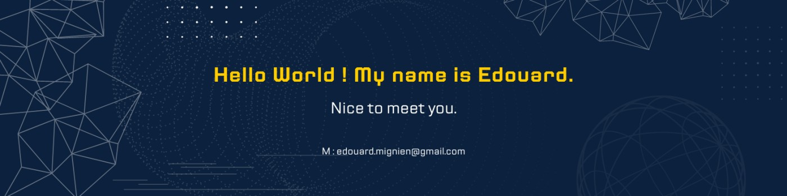

# Edouard Mignien
I'm Edouard from France, and I do Fullstack Development. I really enjoy learning languages and frameworks like Django and React. I also enjoy algorithm and complex backend in general. 

## Skills and Experience
* 🐍 Django
* ⚛ React
* 🗄️PostreSQL, MYSQL
* 💻 Python, JS, HTML, CSS, C, C++, Java

## Personnal Github Summary

<!-- https://github.com/anuraghazra/github-readme-stats -->

<!--
Here are some ideas to get you started:
- 🔭 I’m currently working on ...
- 🌱 I’m currently learning ...
- 👯 I’m looking to collaborate on ...
- 🤔 I’m looking for help with ...
- 💬 Ask me about ...
- 📫 How to reach me: ...
- 😄 Pronouns: ...
- ⚡ Fun fact: ...
-->
