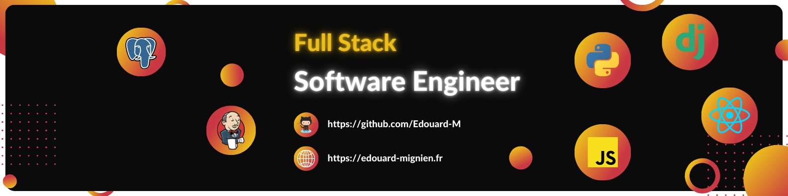

# Edouard Mignien
Hello ! 👋

I'm **Edouard** from **France**, and I'm a **Full Stack software engineer**💻. I really enjoy learning languages and frameworks like **Django** and **React** (my most recent learning is Three.js I'm impressed by the amazing Frontend possibilities of this library). 

I'm also passionate about **algorithms**, **Backend** and **API** in general but what is a great Backend or a great API without any User Interface ? This is the reason of my love for **Full Stack** development: **the possibility to create and sublimate great Backend structure**.✅ 

> Please take a look at my portfolio website showcasing my projects and experiences: **https://edouardmignien.com**

## Skills and Experience
### Tech & Tools Preferences

 
 
 
 

### Other Languages I know
    

## Personnal Github Summary

<!-- https://github.com/anuraghazra/github-readme-stats -->

## Relevant Links

[][website]
[][linkedin]

[website]: https://www.edouardmignien.com/
[linkedin]: https://www.linkedin.com/in/edouard-mignien/

## 📫 How to reach me
*  **EMail:** edouard.mignien@gmail.com
*  (or by my Linkedin account above ⬆️)
